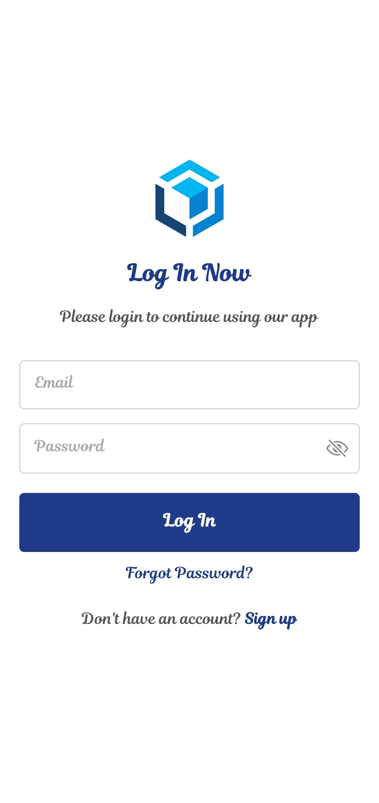

# 🔐 AuthFlow: React Native Authentication

<p align="center">
  
  
  
  
</p>

**AuthFlow** is a comprehensive and secure boilerplate for a user authentication system built with React Native and Expo. It provides a complete, multi-screen user experience for registration, login, and account management, serving as a perfect starting point for any mobile application.

---

## ✨ Features

- 📱 **Cross-Platform** – Built with Expo to run seamlessly on both iOS and Android from a single codebase.
- 👤 **Full Authentication Flow** – Complete user journey from a Welcome screen to Sign-Up, Login, Password Reset, and a private Home screen.
- 🔐 **Robust Validation** – Client-side checks for valid email formats, strong password requirements, and matching fields to ensure data integrity.
- ⚙️ **Global State Management** – Uses React's Context API to manage authentication status and user data across the entire app.
- 🧭 **Modern UI/UX** – Clean, intuitive, and consistent design across all screens, featuring iconography and responsive layouts.
- ⌨️ **Keyboard Handling** – Implements `KeyboardAvoidingView` and `ScrollView` to provide a smooth, professional form-filling experience.

---

## 📸 Screenshots

### 🔹 Core Authentication Screens
Here’s a preview of the main user authentication flow:

<p float="left">
  
  &nbsp;&nbsp;
  
  &nbsp;&nbsp;
  
  &nbsp;&nbsp;
  
</p>

### 🔹 Authenticated Home Screen
A preview of the private dashboard screen visible after a successful login:

<p float="left">
  
</p>

---

## 🚀 Tech Stack

| Tech                  | Description                                      |
| --------------------- | ------------------------------------------------ |
| **React Native** | Primary framework for building the application.  |
| **Expo** | Toolchain for building and running the app.      |
| **React Navigation** | For handling routing and navigation.             |
| **React Context API** | For global state management of user auth.        |
| **Vector Icons** | Used for UI elements like password visibility.   |
| **JavaScript (ES6+)** | Core programming language.                       |
| **Git & GitHub** | Version control and collaboration.               |

---

## 🧩 Folder Structure

- **`/assets`**: Contains static assets like the application logo.
- **`/screenshots`**: Contains the screenshots used in this README file.
- **`AuthContext.js`**: The global state and logic for handling all authentication.
- **`App.js`**: The root component that sets up the main navigator.
- **Screen Components**:
    - `WelcomeScreen.js`
    - `LoginScreen.js`
    - `SignUpScreen.js`
    - `ForgotPasswordScreen.js`
    - `HomeScreen.js`
- **Configuration Files**:
    - `package.json`: Project metadata and dependencies.
    - `app.json`: Expo configuration file.
    - `.gitignore`: Specifies files for Git to ignore.
---

## ⚙️ Setup and Installation

To run this project in a **development environment**, please follow these steps:

### Prerequisites

-   [Node.js](https://nodejs.org/) (LTS version recommended)
-   [Expo Go](https://expo.dev/go) app on your iOS or Android device.
-   A package manager like npm or Yarn.

### Installation

1.  **Clone the repository:**
    ```bash
    git clone https://github.com/CodeSmithAditya/react-native-auth-flow-template.git
    ```

2.  **Navigate to the project directory:**
    ```bash
    cd react-native-auth-flow-template
    ```

3.  **Install dependencies:**
    ```bash
    npm install
    ```

### Running for Development

1.  **Start the Metro server:**
    ```bash
    npx expo start
    ```

2.  **Connect your device:**
    -   Ensure your computer and your mobile device are on the **same Wi-Fi network**.
    -   Open the **Expo Go** app on your device.
    -   Scan the QR code displayed in the terminal.

---

## 📦 Building for Production

The instructions above are for running the app in a development environment. To create a standalone app file (`.apk` or `.ipa`) for distribution on the Google Play Store or Apple App Store, you would use Expo's build service.

This process packages all the code and assets into a single, installable application that runs independently without the need for a development server.

The basic command to start a build is:
```bash
npx expo build
```

You can also build for specific platforms:
#### For Android
```bash
npx expo build:android
```
#### For iOS
```bash
npx expo build:ios
```

---
## 📥 How to Contribute

1. 🍴 Fork the repository
2. 🛠️ Make your changes
3. 🔁 Create a Pull Request
4. 💬 Let's review and merge!
5. 📌 Check [Issues](https://github.com/CodeSmithAditya/react-native-auth-flow-template/issues) and contribute!
6. ✨ Suggestions for improvements and new features are always welcome!

---

## 👤 Author

**Aditya Das**
<br/>
🔗 [LinkedIn](https://www.linkedin.com/in/adadityadas)
<br/>
🐙 [GitHub](https://github.com/CodeSmithAditya)
<br/>
📧 [adadityadas99@gmail.com](mailto:adadityadas99@gmail.com)

---

## 📄 License

This project is protected under the **MIT License** – see the [LICENSE](LICENSE) file for details.
